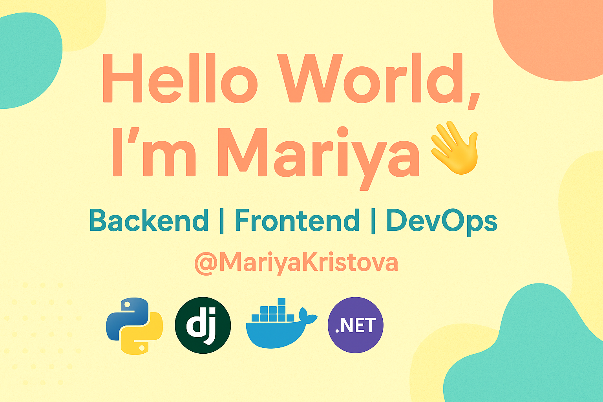

  

🎓 **Software University graduate**  
📍 Sofia, Bulgaria  
💡 Focused on Backend Development & DevOps  
🚀 Open to internships and collaboration opportunities  

---

## 🧩 About Me

I’m a Software University graduate, building projects with **Django**.  
I enjoy improving development workflows and learning DevOps practices like **Docker** and **CI/CD**.

I love creating clean, useful software and continuously growing as a developer.  
Currently focused on strengthening my backend architecture and testing skills.

---

## 🛠 Tech Stack

**Languages:**  
Python • JavaScript

**Frameworks & Tools:**  
Django • GitHub Actions • Docker • Linux • SQL (PostgreSQL/SQLite)

**Topics of interest:**  
DevOps • CI/CD • Cloud • System Design • Databases

---

## 🚀 Featured Projects

Here are some of the projects I am proud of — feel free to explore!

| Project | Tech | Description |
|--------|------|-------------|
| [WishNestApp](https://github.com/MariyaKristova/WishNestApp) | Django | Event & wish list management app. |
| [Petstagram-App](https://github.com/MariyaKristova/Petstagram-App) | Django | A social network for pets (course project). |

> Actively improving documentation and adding new features — stay tuned! 🔧  
> Always open to contributing to open-source 🤝

---

## 📈 GitHub Stats

---

## 📫 How to reach me

📧 Email: **maria.vinogradova@gmail.com**  
🔗 LinkedIn: **[linkedin.com/in/mariya-kristova-71852b261](https://www.linkedin.com/in/mariya-kristova-71852b261/)**  

If you'd like to collaborate, mentor, or just chat — feel free to reach out! 😊

---

### ⭐ Thank you for visiting!  
Don’t forget to star the repositories you like — it helps a lot 💙
